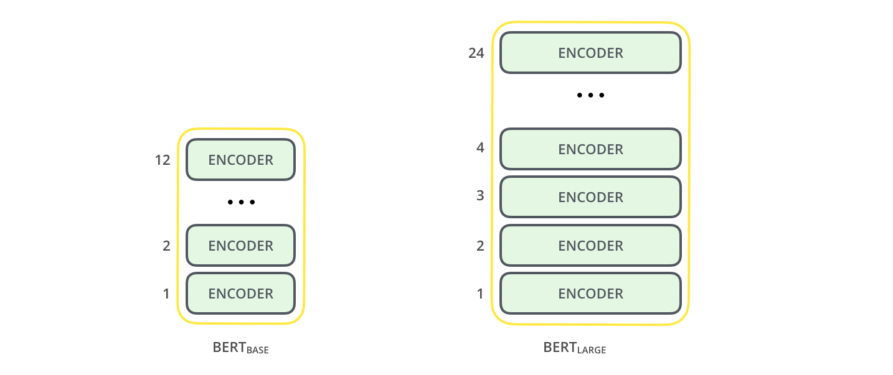
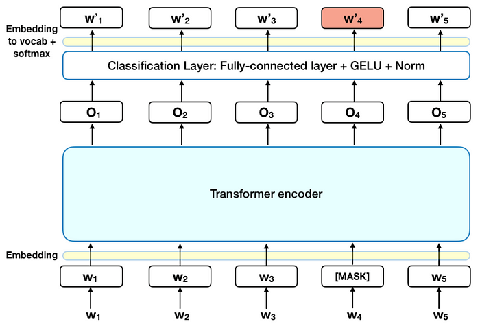
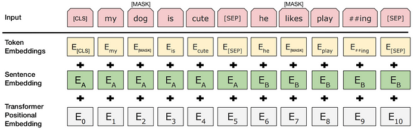

# Bert

上一次我们讲了一种语言模型的训练方法：GPT，现在我们讲述另一种训练方法，BERT。它的全称为“Bidirectional Encoder Representations from Transformers”，是一种预训练语言表示的方法，意味着我们在一个大型文本语料库（如维基百科）上训练一个通用的“语言理解”模型，然后将该模型用于我们关心的下游NLP任务（如问答）。BERT的表现优于之前的传统NLP方法，因为它是第一个用于预训练NLP的无监督的、深度双向系统。

Bert是用无标签的方式建模的。当谈到NLP语料库中的无标签和有标签数据时，一个常见的例子是将文本分类任务。下面是一个例子：

无标签数据：来自维基百科的大量文本，这些文本没有被人工标记或者标注。这些数据可以用来预训练语言模型，例如 BERT、GPT 等，以学习通用的语言表示形式。

有标签数据：例如 IMDB 电影评论数据集，其中每个评论都被标记为正面或负面情感。这些数据可以用来训练文本分类器，使其能够自动对新的评论进行情感分类。

Bert的无监督预训练方法非常重要，因为它允许我们在大规模文本语料库中进行训练，而无需为每个具体的NLP任务收集大量的有标签数据。由于网络上有大量的无标签文本数据，这种方法使得BERT可以利用这些数据来训练模型，提高模型在各种任务上的表现。与此同时，无监督预训练还能够提高模型对于语言的理解和表达能力。BERT的无监督预训练方法使得我们可以使用一个通用的"语言理解"模型，用于各种NLP任务，如问答、文本分类、实体识别等，而无需为每个任务重新训练一个新的模型。BERT 的主要任务是通过训练模型来预测文本序列中缺失的单词，因此模型只需要对输入的文本序列进行编码，而不需要对序列进行解码。

<figure><figcaption></figcaption></figure>

## Pre-training BERT

Pre-training BERT（Bidirectional Encoder Representations from Transformers）是一种基于大规模无标注文本数据的预训练方法，它是Bert中的一个阶段，目的是为了训练出一个通用的语言模型，能够理解上下文语境中词语的语义信息。

在BERT的预训练过程中，使用了两个阶段的训练方式：Masked LM和Next Sentence Prediction，这两个任务都是在编码器的基础上进行的。

（1）Masked LM（MLM）

Masked Language Modeling (MLM) 是 BERT 模型的一种预训练方法，通过将输入文本中的某些单词随机地替换成特殊的 \[MASK] 标记，使模型在预测被替换的单词时需要依据上下文信息进行推断，从而学习到单词的上下文相关性。

具体来说，对于输入文本中的每个单词，以一定的概率（比如15%）随机选择将其替换为 \[MASK] 标记，然后将经过 \[MASK] 标记处理后的文本输入给模型进行预测。在预测过程中，模型需要根据上下文信息猜测被 \[MASK] 标记替换的单词。这样的预测任务可以促使模型学习到单词的上下文信息，从而提高下游任务的性能。

例如，对于输入文本 "I went to the \[MASK] to buy some apples"，模型需要根据上下文信息猜测被 \[MASK] 标记替换的单词是 "store"，"market"，"shop" 等。通过这样的预测任务，模型可以学习到 "store"，"market"，"shop" 在不同上下文中的含义和用法，从而提高下游任务（如文本分类、情感分析、问答等）的性能。因为采用上下文无关的方式进行建模，意味着模型不考虑单词在句子中的位置和上下文环境，而是将每个单词独立地编码为固定的向量表示。所以MLM是至关重要的，因为他学习了上下文的信息。

<figure><figcaption><p>Masked LM（MLM）训练过程</p></figcaption></figure>

（2）Next Sentence Prediction（NSP）

Next Sentence Prediction (NSP) 是 BERT 中的另外一种预训练任务，用于训练模型学习句子之间的关系。它的目标是判断两个句子是否是相邻的，即判断一个句子是否是另一个句子的下一句。

NSP 的训练过程中，对于每一对输入的句子，有一半是相邻的，另一半是随机选择的不相邻的句子。模型需要对这两种情况进行分类预测。这个任务主要是为了帮助模型学习更好的语义表示，尤其是对于需要理解多个句子之间关系的任务，如问答和文本推理。

<figure><figcaption></figcaption></figure>

输入的文本会被分成多个token，每个token会被映射为一个向量表示，这个向量表示就被称为token embedding。

除了token embedding之外，BERT还有另外两种embedding，分别是sentence embedding和positional embedding。

Sentence embedding是对整个句子进行编码得到的向量表示。在BERT中，对于输入的句子对（比如问答场景下的问题和回答），BERT会将句子对之间的特殊标记“\[SEP]”添加到中间，并在整个输入序列的开头添加另一个特殊标记“\[CLS]”。然后，整个序列的第一个token对应的向量就是整个句子的sentence embedding。

Positional embedding则是用来表示每个token在句子中的位置信息。由于Transformer并不保留输入中token的位置信息，因此需要在输入的token embedding中加入位置信息，使得Transformer能够捕捉到句子中token的位置信息。这里采用了一种相对位置编码的方式，将每个token与其他token的相对位置信息编码成一个向量，然后将该向量加到该token的embedding中。

<figure><figcaption></figcaption></figure>

在BERT中，这三种embedding会被拼接在一起，然后送入Transformer进行编码。这些编码代表了符号句子位置的特征。

通过使用 MLM 和 NSP 两个任务来预训练模型，BERT 能够学习到更加丰富的语言表示，这些表示可以在各种 NLP 任务中进行微调。

## Fine-tuning BERT

Fine-tuning BERT是指在使用预训练的BERT模型后，将其进一步调整以适应特定任务的过程。这个过程可以理解为在BERT的基础上进行微调以使其更加适合完成特定的自然语言处理（NLP）任务。

Fine-tuning BERT的主要步骤如下：

1. 准备数据集：根据特定的NLP任务，准备相应的数据集，包括训练集、验证集和测试集。
2. 定义任务：根据任务类型，选择适当的BERT模型和Fine-tuning策略。对于分类任务，可以使用BERT的CLS向量来表示整个句子，并通过添加一个全连接层来预测标签。对于序列标注任务，可以在BERT的基础上添加一个序列标注层。
3. Fine-tuning：将准备好的数据集输入BERT模型进行Fine-tuning。在Fine-tuning过程中，对BERT模型的参数进行微调，以适应特定的NLP任务。通常使用反向传播算法进行模型优化。
4. 模型评估：使用验证集评估Fine-tuning后的模型性能，可以根据验证集的性能调整Fine-tuning策略或BERT模型的超参数。最终，使用测试集评估模型的性能。

<figure><figcaption><p>不同任务的微调</p></figcaption></figure>

需要注意的是，Fine-tuning BERT需要大量的计算资源和时间，因为BERT模型本身具有非常多的参数和复杂的结构。此外，Fine-tuning BERT的性能还取决于任务的复杂性、数据集的质量和模型的选择等因素。

## 代码实现

下面是使用PyTorch实现Bert模型的示例代码，包括模型定义、数据预处理、模型训练和推理：

```python
import torch
import torch.nn as nn
import torch.optim as optim
import torch.utils.data as data
import transformers

# 1. 定义Bert模型
class BertModel(nn.Module):
    def __init__(self, bert_config):
        super(BertModel, self).__init__()
        self.bert = transformers.BertModel(bert_config)
        self.dropout = nn.Dropout(bert_config.hidden_dropout_prob)
        self.fc = nn.Linear(bert_config.hidden_size, num_classes)

    def forward(self, input_ids, attention_mask):
        output = self.bert(input_ids=input_ids, attention_mask=attention_mask)
        output = output[1]  # 取第1个tensor作为CLS向量
        output = self.dropout(output)
        output = self.fc(output)
        return output

# 2. 数据预处理
# 数据集包含输入序列和对应的标签
inputs = ["I love Python programming.", "Python is a high-level programming language."]
labels = [0, 1]  # 0表示第1个句子不是关于Python编程的，1表示第2个句子是关于Python编程的

tokenizer = transformers.BertTokenizer.from_pretrained('bert-base-uncased')
max_seq_length = 64  # 输入序列最大长度
inputs_ids = []
attention_masks = []

for input_text in inputs:
    # 将文本转换为ids和attention mask
    encoded_dict = tokenizer.encode_plus(
        input_text,
        add_special_tokens=True,
        max_length=max_seq_length,
        pad_to_max_length=True,
        return_attention_mask=True,
        return_tensors='pt'
    )
    inputs_ids.append(encoded_dict['input_ids'])
    attention_masks.append(encoded_dict['attention_mask'])

inputs_ids = torch.cat(inputs_ids, dim=0)
attention_masks = torch.cat(attention_masks, dim=0)
labels = torch.tensor(labels)

# 3. 定义超参数和优化器
num_classes = 2
learning_rate = 2e-5
num_epochs = 3
batch_size = 2

device = torch.device("cuda" if torch.cuda.is_available() else "cpu")

model = BertModel(transformers.BertConfig.from_pretrained('bert-base-uncased')).to(device)
optimizer = optim.Adam(model.parameters(), lr=learning_rate)

# 4. 定义数据加载器
dataset = data.TensorDataset(inputs_ids, attention_masks, labels)
dataloader = data.DataLoader(dataset, batch_size=batch_size, shuffle=True)

# 5. 训练模型
model.train()
for epoch in range(num_epochs):
    for i, (input_ids_batch, attention_masks_batch, labels_batch) in enumerate(dataloader):
        input_ids_batch = input_ids_batch.to(device)
        attention_masks_batch = attention_masks_batch.to(device)
        labels_batch = labels_batch.to(device)

        optimizer.zero_grad()

        outputs = model(input_ids_batch, attention_masks_batch)
        loss = nn.CrossEntropyLoss()(outputs, labels_batch)
        loss.backward()

        optimizer.step()

        if i % 10 == 0:
            print(f"Epoch {epoch}, batch {i}, loss: {loss.item()}")

# 6. 模型推理
model.eval()
test_input = "Python is a popular programming language."
encoded_dict = tokenizer.encode_plus(
    test_input,
    add_special_tokens

```
