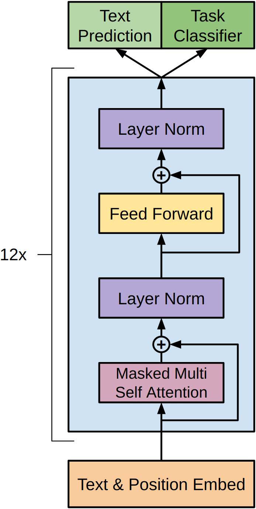
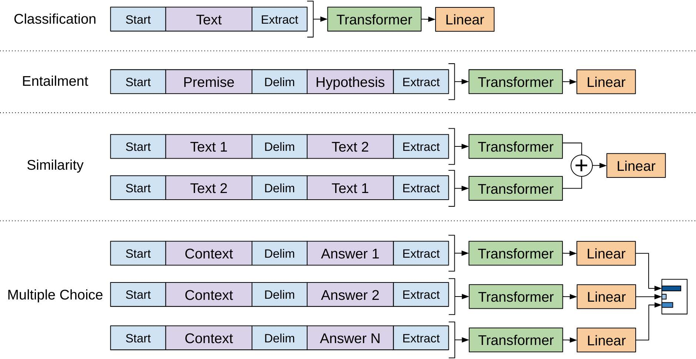

# GPT

GPT全称为Generative Pre-trained Transformer，它使用了Transformer中的Decoder架构，并通过大规模的无监督预训练来提高模型的表现力。在预训练阶段，GPT通过处理大量的无标注文本数据，学习到了语言的统计规律和上下文信息。在实际应用时，GPT可以通过微调（fine-tuning）的方式，根据具体任务的需求，对预训练的模型进行微小的调整，从而适应不同的文本生成、问答等任务。GPT在自然语言生成和处理任务上表现出色，在多个公开数据集上都取得了很好的成绩。


<figure><figcaption><p>GPT中的Decoder</p></figcaption></figure>

## 无监督的预训练

GPT的无监督预训练就是让模型自己学习语言的规律和上下文信息，而无需人为标注数据。在预训练阶段，GPT使用了大量的无标注文本数据进行训练，例如维基百科、互联网新闻等大规模语料库。GPT将这些文本数据输入到模型中，通过不断地学习语言中的统计规律和上下文信息，提高模型的表现力。

在这个阶段中，GPT最早期使用的是一种基于自回归模型的语言模型，它通过最大化给定输入序列的下一个单词出现的概率来预训练模型。

自回归模型的目标是最大化模型对无标注文本数据的似然性，即最大化模型在给定无标注文本数据下的对数似然函数。我们希望训练出来的模型可以在当前输入文本序列的基础上，预测下一个单词出现的概率。而预测概率的一个重要指标就是似然性，即当前模型预测的结果与实际观测值之间的相似程度。

<figure><figcaption></figcaption></figure>

假设我们有一个无标注文本数据集 $$D = {x_1, x_2, ..., x_N}$$，其中每个 $$x_i$$是一个长度为 $$T_i$$的文本序列，而模型的参数为 $$\theta$$。假设我们的模型能够将 $$x_i$$中的每个单词表示为 $${w_{i,1}, w_{i,2}, ..., w_{i,T_i}}$$，那么模型对于 $$x_i$$的对数似然函数可以表示为：

$$\log p(x_i|\theta)=\sum_{t=1}^{T_i}\log p(w_{i,t}|w_{i,<t},\theta)$$

其中， $$p(w_{i,t}|w_{i, <t},\theta)$$表示给定上文 $$w_{i, <t}$$的情况下，模型对于 $$w_{i,t}$$的条件概率分布。

在GPT2，GPT3中在预训练阶段还引入了掩码语言模型（MLM，Masked Language Model，和Bert中的一样）

MLM的目标是在输入序列中随机遮盖一些单词，并让模型预测这些被遮盖的单词。

掩码语言模型（Masked Language Model，MLM）的似然函数表示为：

$$L_{MLM}=\prod_{i=1}^{N}P(w_{i}|w_{<i},w_{>i})$$

其中， $$w_{i}$$表示第 $$i$$个位置的被遮蔽的单词，通常在文本中用一个特殊符号“\[MASK]”标记， $$w_{<i}$$表示第 $$i$$个位置之前的单词序列， $$w_{>i}$$表示第$i$个位置之后的单词序列， $$N$$表示文本序列的长度。这些都是通过多层级联的Transformer的decoder实现的。通过梯度下降的训练方法，可以使得似然函数最大。

## 有监督的微调

GPT中的Supervised fine-tuning是指在完成了无监督的预训练后，使用有标注数据对模型进行有监督的微调，以适应特定的下游任务。

<figure><figcaption></figcaption></figure>

假设我们有一个已经预训练好的GPT模型，它的参数为 $$\theta$$。现在，我们想将这个模型应用于一个下游任务，例如文本分类任务。在文本分类任务中，我们有一个由 $$N$$个样本组成的训练集，其中第 $$i$$个样本的输入为 $$x_i$$，对应的标签为 $$y_i$$。

在进行Supervised fine-tuning时，我们需要对GPT模型进行微调，以适应特定的下游任务。我们可以将GPT模型的输出层进行修改，例如添加一个全连接层，并将其连接到GPT模型的最后一个隐藏层。我们可以将这个修改后的模型表示为 $$GPT_{\text{ft}}(\cdot;\theta_{\text{ft}})$$，其中 $$\theta_{\text{ft}}$$是微调后的参数。

对于文本分类任务，我们可以定义一个损失函数 $$L_{\text{cls}}$$，cls代表输入的开端，损失函数用于衡量模型在分类任务上的性能。常见的损失函数包括交叉熵损失和均方误差损失等。我们的目标是最小化损失函数 $$L_{\text{cls}}$$，以适应特定的下游任务。我们可以通过以下步骤来实现Supervised fine-tuning：

1. 将预训练好的GPT模型的输出层进行修改，得到修改后的模型 $$GPT_{\text{ft}}(\cdot;\theta_{\text{ft}})$$。
2. 在训练集上对修改后的模型进行训练，这里和预训练的文本集合不同，Fine-Tuning使用的是带有标签的数据集，如情感分类、文本生成、问答等任务的标注数据集，而预训练的集合是无标签的。最小化损失函数 $$L_{\text{cls}}$$。可以使用随机梯度下降等优化算法进行训练。
3. 微调完成后，使用测试集对模型进行评估，并计算模型在下游任务上的性能指标，例如准确率、F1值等。

Supervised fine-tuning的数学表示可以如下表示：

$$\min_{\theta_{\mathrm{ft}}}\frac{1}{N}\sum_{i=1}^N L_{\mathrm{cls}}(GPT_{\mathrm{ft}}(x_i;\theta_{\mathrm{ft}}),y_i)\quad\quad\text{}$$

其中， $$L_{\text{cls}}(\cdot, \cdot)$$表示分类任务的损失函数， $$x_i$$表示第$i$个样本的输入， $$y_i$$表示第$i$个样本的标签。我们的目标是找到微调后的参数 $$\theta_{\text{ft}}$$，使得模型在训练集上的损失函数最小。

在 Improving Language Understanding by Generative Pre-Training 这篇论文中，作者提出了一种自适应的学习率策略，用于在 GPT 中进行训练。训练的过程中只用到了 $$12$$层的decoder网络。

## GPT的pytorch实现

首先，需要导入需要用到的库和模块：

```python
import torch
import torch.nn as nn
from torch.nn import functional as F

```

接下来，定义GPT模型的主要组成部分——Transformer Decoder。这里我们参考GPT-2，使用12个Transformer Decoder来构建整个模型。在每个Transformer Decoder中，都包含一个多头自注意力机制（multi-head self-attention），一个前馈神经网络（feedforward neural network）和一个残差连接（residual connection）：

```python
class TransformerDecoder(nn.Module):
    def __init__(self, hidden_dim, num_heads, ff_dim, dropout):
        super().__init__()

        self.multihead_attn = nn.MultiheadAttention(hidden_dim, num_heads)
        self.dropout1 = nn.Dropout(dropout)
        self.layer_norm1 = nn.LayerNorm(hidden_dim)

        self.ff = nn.Sequential(
            nn.Linear(hidden_dim, ff_dim),
            nn.ReLU(),
            nn.Dropout(dropout),
            nn.Linear(ff_dim, hidden_dim),
        )
        self.dropout2 = nn.Dropout(dropout)
        self.layer_norm2 = nn.LayerNorm(hidden_dim)

    def forward(self, x, mask):
        # Multi-head self-attention
        attn_out, _ = self.multihead_attn(x, x, x, attn_mask=mask)
        attn_out = self.dropout1(attn_out)
        x = self.layer_norm1(x + attn_out)

        # Feedforward neural network
        ff_out = self.ff(x)
        ff_out = self.dropout2(ff_out)
        x = self.layer_norm2(x + ff_out)

        return x

```

接下来，我们将这些Transformer Decoder串联起来，形成整个GPT模型：

```python
class GPT(nn.Module):
    def __init__(self, num_tokens, hidden_dim, num_heads, num_layers, seq_len, dropout):
        super().__init__()

        self.token_emb = nn.Embedding(num_tokens, hidden_dim)
        self.pos_emb = nn.Parameter(torch.zeros(1, seq_len, hidden_dim))
        self.dropout = nn.Dropout(dropout)

        self.decoders = nn.ModuleList([
            TransformerDecoder(hidden_dim, num_heads, hidden_dim * 4, dropout)
            for _ in range(num_layers)
        ])

        self.output_layer = nn.Linear(hidden_dim, num_tokens)
        self.softmax = nn.Softmax(dim=-1)

    def forward(self, x):
        # Token embeddings
        x = self.token_emb(x)

        # Add position embeddings
        x += self.pos_emb[:, :x.shape[1]]

        # Transformer Decoder layers
        mask = torch.triu(torch.ones(x.shape[1], x.shape[1]), diagonal=1).bool().to(x.device)
        for decoder in self.decoders:
            x = decoder(x, mask)

        # Output layer
        x = self.output_layer(x)
        x = self.softmax(x)

        return x

```

最后，我们可以定义训练过程，包括损失函数、优化器等：

```python
model = GPT(num_tokens, hidden_dim, num_heads, num_layers, seq_len, dropout)
criterion = nn.CrossEntropyLoss()
optimizer = torch.optim.Adam(model.parameters(), lr=lr)

for epoch in range(num_epochs):
    for inputs, labels in dat

```
