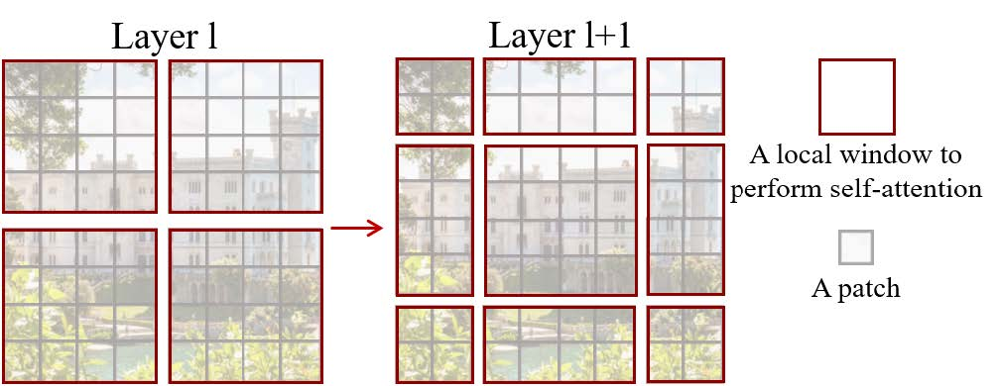

# 😀 Swin Transformer

当我们想要处理一些自然语言或图像数据时，我们通常会使用神经网络来学习数据的特征，以便进行分类、预测或生成等任务。

而 Swin Transformer 是一种新型的神经网络结构，它结合了 Transformer 和滑动窗口的思想。在 Swin Transformer 中，我们将输入的数据分割成不同的区块，每个区块都与自身和相邻区块进行交互学习。通过这种方式，网络能够更好地捕捉数据的局部和全局特征。

在图像分类任务中，Swin Transformer 能够比传统的卷积神经网络更好地捕捉到图像的细节信息，从而取得更好的性能。同时，Swin Transformer 也可以应用于其他自然语言处理和计算机视觉任务。

<figure><figcaption><p><a href="https://github.com/microsoft/Swin-Transformer">Swin Transformer 结构图</a></p></figcaption></figure>

### 图片表示

首先，我们需要将输入的图像进行表示。在Swin Transformer中，将输入的图像分成一个个大小相同的块，每个块的大小为 $$H\times W\times C$$，其中 $$H$$和 $$W$$分别表示块的高度和宽度， $$C$$表示通道数。对于一张 $$H_i\times W_i\times C$$ 的图像，如果我们将其划分成大小为 $$P\times P$$的块，则一共可以得到 $$\frac{H_i}{P}\times\frac{W_i}{P}$$个块，每个块可以表示为一个 $$P\times P\times C$$ 的张量。

<figure><figcaption><p>Vision Transformer的示例图，来自《<a href="https://d2l.ai/chapter_attention-mechanisms-and-transformers/vision-transformer.html">动手学深度学习》</a></p></figcaption></figure>

### Patch Embedding

接下来，我们需要将每个块进行向量化表示，这个过程称为Patch Embedding。每个块(patch)被压缩成一个小的向量，并被传递给Transformer编码器。这些向量被称为“patch embeddings”，它们代表了原始图像中对应的图像块的特征。在Swin Transformer中，使用一个 $$1\times 1$$ 的卷积层来将每个块的通道数从 $$C$$变为$$D$$，其中 $$D$$是Transformer的维度。这样，我们就得到了一个形状为 $$(\frac{H_i}{P})\times(\frac{W_i}{P})\times P\times P\times D$$的张量，可以看作是一个二维网格，其中每个格子都是一个 $$D$$维的向量。

Patch Embedding的作用是将图像转换为一系列可处理的向量，以便Transformer可以对它们进行处理。这种方法允许Swine Transformer模型有效地处理大型图像，并在计算效率和准确性之间取得平衡。

### Swin Transformer Block

Swin Transformer Block的原理基于自注意力机制（Self-Attention Mechanism），其思想是将输入序列中的每个元素都看作是查询（query）、键（key）和值（value），通过计算它们之间的相似度得到注意力分布，然后根据注意力分布加权求和得到输出。Swin Transformer Block的关键之处在于采用了分层式的自注意力机制，通过不同的层次分别处理不同的特征。 具体来说，Swin Transformer Block包含四个子模块：多头注意力模块、全连接层（Feed-Forward）、跨窗口的路径（Shifted Window Path）、层归一化（Layer Normalization）。其中多头注意力模块用于在不同的窗口中学习不同的特征，全连接层用于增强模型的非线性能力，跨窗口的路径模块用于促进不同特征的交互，层归一化模块用于加速模型的训练收敛和提高模型的泛化能力。

<figure><figcaption><p>Swin Transformer Blockd的结构示意图 LN代表Layer Normalization MSA代表了上一节所说的多头自注意力</p></figcaption></figure>

#### 跨窗口的自注意力（Shifted Window Self-Attention）

跨窗口的自注意力分为基于窗口的多头自注意力机制（W-MSA）和跨窗口的自注意力（SW-MSA)。

W-MSA将输入特征张量沿着通道维度分割成若干个小张量，然后对每个小张量进行多头自注意力计算。具体来说，W-MSA将输入特征张量 $$X\in \mathbb{R}^{H\times W\times C}$$（其中 $$H,W$$分别为输入特征张量的高度和宽度，为通道数）分成大小为 $$h\times w\times c$$的若干个窗口，其中 $$h$$和 $$w$$分别为窗口的高度和宽度， $$c$$为通道数，也即一个窗口中包含 $$h\times w\times c$$个元素。然后，W-MSA对每个窗口内的特征进行多头自注意力计算，并将得到的多个输出特征拼接起来，形成最终的输出特征张量。

具体来说，对于每个窗口，W-MSA将其视为一个子特征张量 $$X_i\in \mathbb{R}^{h\times w\times c}$$，并将其通过三个线性映射矩阵 $$W_q\in \mathbb{R}^{d_k\times c},W_k\in \mathbb{R}^{d_k\times c},W_v\in \mathbb{R}^{d_v\times c}$$（其中 $$d_k,d_v$$为自注意力机制中的查询向量和值向量的维度）分别映射成查询向量 $$Q_i\in \mathbb{R}^{h\times w\times d_k},K_i\in \mathbb{R}^{h\times w\times d_k},V_i\in \mathbb{R}^{h\times w\times d_v}$$。然后，W-MSA计算每个查询向量和所有键向量之间的内积，得到注意力分布矩阵 $$A_i\in \mathbb{R}^{h\times w\times h\times w}$$，其中 $$A_{i,j,k,l}$$表示输入特征张量中位置 $$(i,j)$$与位置 $$(k,l)$$之间的注意力权重。注意力分布矩阵 $$A_i$$也可以看做是两个子特征张量 $$X_i$$和 $$X_j$$之间的相似度矩阵，即它表示了在子特征张量 $$X_i$$中的每个位置与子特征张量 $$X_j$$中的每个位置之间的相似度。

接下来，W-MSA根据注意力分布矩阵 $$A_i$$和值向量 $$V_i$$，通过加权求和得到每个子特征张量的输出特征矩阵 $$O_i\in \mathbb{R}^{h\times w\times d_v}$$，即 $$O_i=\text{softmax}(\frac{Q_iK_i^\top}{\sqrt{d_k}})V_i$$。这个操作可以理解为对每个位置 $$(i,j)$$，通过查询向量 $$Q_{i,j}$$与所有键向量 $$K_{k,l}$$计算注意力分布矩阵 $$A_{i,j,k,l}$$，然后将注意力分布矩阵 $$A_{i,j,k,l}$$与值向量 $$V_{k,l}$$进行加权求和，得到该位置的输出特征向量 $$O_{i,j}$$。

最后，W-MSA将所有子特征张量的输出特征矩阵拼接起来，并通过一个线性映射矩阵 $$W_o\in \mathbb{R}^{C\times d_v\cdot n}$$将其映射回原来的通道维度，其中 $$n$$为窗口的数量。这样，W-MSA就实现了输入特征张量中局部区域内的特征交互和信息传递，同时保留了输入特征张量中全局的信息。

SW-MSA代表"Shifted Window Multi-head Self-Attention"，是Swin Transformer Block中的一种自注意力机制。相比于传统的自注意力机制，SW-MSA使用了一种移位窗口策略来进行计算。

首先，假设输入特征图为 $$X \in \mathbb{R}^{H \times W \times C}$$，其中$$H、W$$ 和 $$C$$ 分别表示高度、宽度和通道数。假设每个块的大小为 $$B_h \times B_w \times C$$，其中 $$B_h$$ 和 $$B_w$$ 分别表示块的高度和宽度。

SW-MSA 的计算过程如下：将输入特征图 $$X$$ 按块大小 $$B_h \times B_w \times C$$ 划分为多个块 $$x_{ij} \in \mathbb{R}^{B_h \times B_w \times C}$$，其中 $$i$$和 $$j$$ 分别表示块在垂直和水平方向上的索引，即 $$i \in {1, 2, ..., \frac{H}{B_h}}$$， $$j \in {1, 2, ..., \frac{W}{B_w}}$$。 对于每个块  $$x_{ij}$$，进行以下计算：

&#x20;a.首先，将块 $$x_{ij}$$ 重塑为矩阵 $$X_{ij} \in \mathbb{R}^{N \times C}$$，其中 $$N = B_h \times B_w$$表示块中位置的总数，每行是块中的一个位置。

&#x20;b.然后，计算矩阵 $$X_{ij}$$ 的多头自注意力得分 $$S_{ij} \in \mathbb{R}^{N \times N}$$，其中每个得分 $$s_{kl}$$ 表示第 $$k$$ 个位置和第 $$l$$ 个位置之间的相似度得分，计算公式为：

$$
s_{kl}=\dfrac{1}{\sqrt{d_k}}\cdot q_k(X_{ij})\cdot k_l(X_{ij})^\top
$$

其中 $$q_k$$ 和 $$k_l$$ 分别表示对输入进行线性变换得到的查询和键， $$d_k$$ 表示注意力头的维度。可以使用矩阵乘法和重塑操作来同时计算所有位置之间的得分：

$$
S_{ij}=software(\dfrac{1}{\sqrt{d_k}}Q_k(X_{ij})K_k(X_{ij})^{\top})
$$

c.接下来，计算块中每个位置的加权和，其中每个位置的权重由得分 $$S_{ij}$$ 决定：

$$
Y_{ij}=\sum\limits_{l=1}^N S_{ij}(l,:)V_k(X_{ij})(l,:)
$$

其中 $$V_k$$ 表示对输入进行线性变换得到的值。可以使用矩阵乘法和重塑操作来同时计算所有位置的加权和：

$$
Y_{ij}=software(\dfrac{1}{\sqrt{d_k}}Q_k(X_{ij})K_k(X_{ij})^{\top})\quad
$$

d.最后，将加权和 $$Y_{ij}$$ 重塑为块 $$x_{ij}$$ 的形状并应用残差连接和层归一化，得到 SW-MSA 的输出特征图。

需要注意的是，在多头自注意力得分的计算中，通常会对查询、键和值进行不同的线性变换，以便学习到不同的特征表示。同时，为了加速计算，通常还会对得分矩阵进行分块和并行计算，以便能够处理更大的输入特征图。

用非常简单的话来说，W-MSA在计算块间的注意力，SW-MSA计算了块内的注意力，这不正是我们之前所介绍的encoder-decoder架构吗？

### Shifted window partitioning in successive blocks

前面非常详细地讲了怎么计算注意力以及Swin Transformer Blocks的架构，这里我们还要详细讲一下这些窗口是怎么划分的。

在Swin Transformer中，每个块都有一个特定的窗口大小，这个窗口大小通常较小，以便让模型更好地捕捉图像中的局部特征。当输入的特征图大小超过一个块的窗口大小时，就需要将输入的特征图分成多个块进行处理。

Shifted window partitioning是一种在不同块之间共享信息的方式。具体来说，假设我们要将一个输入特征图分成4个块进行处理，第一个块的位置从左上角开始，每个块之间重叠一定的像素。Shifted window partitioning就是在第二个块中将窗口向右移动一定的距离，使其与第一个块重叠部分的右侧对齐。同样，第三个块的窗口向下移动一定的距离，使其与第二个块重叠部分的下侧对齐。这样，不同块之间就可以共享信息，从而更好地捕捉图像中的上下文信息。

<figure><figcaption></figcaption></figure>

Swin Transformer中采用的是分层窗口机制，即通过不断对输入特征图进行分块和重组，从而在不同层次上实现窗口大小和划分方式的变化。具体来说，Swin Transformer的每个阶段都会将输入特征图分成若干个大小相同的块，然后在块内进行自注意力计算。随着阶段的增加，每个块内部的自注意力计算所涉及的位置数量也会逐渐扩大，从而实现窗口大小和划分方式的变化。

在Swin Transformer的设计中，每个阶段的块数和块的大小都是可以配置的，这使得模型能够适应不同的输入尺寸和任务需求。同时，Swin Transformer还引入了跨阶段连接机制，通过跨越多个阶段来传递信息，进一步提升了模型的性能。

Swin Transformer中包含多个阶段（stage），每个阶段都包含多个层（layer）。不同阶段的块数和块的大小不同，因此不同层的窗口划分方法也不同。

以Swin Transformer-B作为例子，具体的窗口划分方法如下：

* Stage 1（输入阶段）：输入图像被分成若干个大小为 $$4\times 4$$的块，并按照行优先的顺序组成特征图。每个块都只与其相邻的块进行自注意力计算。
* Stage 2：输入特征图被分成若干个大小为 $$2\times 2$$的块，并按照行优先的顺序组成特征图。每个块都与相邻的2个块和其自身共同进行自注意力计算。
* Stage 3：输入特征图被分成若干个大小为 $$4\times 4$$的块，并按照行优先的顺序组成特征图。每个块都与相邻的2个块和其自身共同进行自注意力计算。
* Stage 4：输入特征图被分成若干个大小为 $$8\times 8$$的块，并按照行优先的顺序组成特征图。每个块都与相邻的2个块和其自身共同进行自注意力计算。&#x20;
* Stage 5：输入特征图被分成若干个大小为 $$16\times 16$$的块，并按照行优先的顺序组成特征图。每个块都与相邻的2个块和其自身共同进行自注意力计算。

可以看出，随着网络深度的增加，输入特征图的块大小也不断增大，每个块的上下左右相邻块的数量也随之增加，从而在不同层次上实现了不同的窗口划分方式。这种分层窗口机制可以充分利用网络深度，兼顾局部和全局信息，有效提高了模型的性能。


假设我们要将一个大小为 $$H \times W$$的输入特征图分成 $$n \times n$$个块进行处理，每个块的大小为 $$n \times n$$，其中 $$h = \frac{H}{n}$$， $$w = \frac{W}{n}$$。为了使不同块之间能够共享信息，我们需要使相邻的块之间有重叠的部分，可以使用Shifted window partitioning技术来实现。具体来说，我们可以将每个块的位置表示为 $$(i,j)$$，其中 $$i,j \in {1,2,...,n}$$，表示第 $$i$$行，第 $$j$$列的块。为了使相邻的块之间有重叠的部分，我们可以定义每个块的起始位置为：

$$
\begin{array}{c}x_i=(i-1)\times\dfrac{H}{n}-\lfloor\dfrac{h}{2}\rfloor\\ y_j=(j-1)\times\dfrac{W}{n}-\lfloor\dfrac{w}{2}\rfloor\end{array}
$$

其中， $$\lfloor \cdot \rfloor$$表示向下取整操作。这里的起始位置是指每个块左上角的像素在输入特征图中的位置。

然后，我们可以使用以下公式来计算每个块的结束位置：

$$
\begin{array}{c}x'_i=x_i+h-1\\ y'_j=y_j+w-1\end{array}
$$

这里的结束位置是指每个块右下角的像素在输入特征图中的位置。

因此，我们可以将输入特征图分成 $$n \times n$$个块，每个块的大小为 $$h \times w$$，且相邻块之间有重叠的部分。具体的划分方法可以通过以下公式表示：

例如，当 $$n=2$$时，输入特征图被分成如下四个块：

```diff
// Some code
+--------+--------+
|        |        |
|        |        |
|   1    |   2    |
|        |        |
|        |        |
+--------+--------+
|        |        |
|        |        |
|   3    |   4    |
|        |        |
|        |        |
+--------+--------+

```

其中，每个块的起始位置和结束位置分别为：

* 块1： $$(x_{1,1}, y_{1,1})$$到 $$(x'{1,1}, y'{1,1})$$
* 块2： $$(x_{1,2}, y_{1,2})$$到 $$(x'{1,2}, y'{1,2})$$
* 块3： $$(x_{2,1}, y_{2,1})$$ 到 $$(x'{2,1}, y'{2,1})$$
* 块4： $$(x_{2,2}, y_{2,2})$$到 $$(x'{2,2}, y'{2,2})$$
